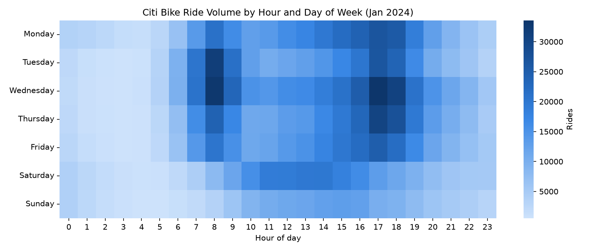

# NYC Citi Bike Analysis

Exploratory analysis of NYC's Citi Bike system using January 2024 trip data
(~1.9M rides) — cleaning, EDA, and a look at how members (subscribers) and
casual riders use the system differently: when they ride, how long for, and
where.

## Contents

- [`CitiBike_Analysis.ipynb`](CitiBike_Analysis.ipynb) — the notebook: loads
  the month's trip data directly from Citi Bike's public S3 feed, cleans it,
  and walks through trip duration, rider mix, ride timing, and busiest
  stations.
- [`docs/`](docs/index.html) — a three-page static site built on the notebook's
  findings: a landing page with the project overview and key stats, an
  interactive ride-volume [heatmap](docs/heatmap.html) by hour and day of
  week, and a geospatial [ridership map](docs/map.html) of station density
  against NYC's bike lane network, scrubbable by hour of day.
  [**View it live**](https://ancientabacus.github.io/NYC-CitiBike-Analysis/)
  (once GitHub Pages is enabled for this repo — see below).

## The heatmap



Weekday ridership shows a sharp AM/PM commute pattern (8am and 5-6pm); weekend
ridership spreads across a broader, later midday window instead — members
commute, casual riders wander in on their own schedule.

## The ridership map

[`docs/map.html`](docs/map.html) plots the same January 2024 trips
geospatially: a Leaflet heat layer of trip starts per station (toggleable, and
scrubbable through the 24 hours to watch the commute rush move across the
city), overlaid on NYC DOT's actual bike lane network so you can see how
ridership relates to where the infrastructure is — or isn't.

## Data source

[Citi Bike System Data](https://citibikenyc.com/system-data), published
monthly as zipped CSVs at `https://s3.amazonaws.com/tripdata/index.html`. The
notebook downloads the file at runtime — no data is committed to this repo.

## Running the notebook

Requires `pandas`, `requests`, `matplotlib`, and `seaborn`. Run top-to-bottom
in Jupyter — later cells depend on the cleaned DataFrame built earlier in the
notebook.

## Enabling the website

The site lives in `docs/` so it can be served straight from GitHub Pages:
repo **Settings → Pages → Deploy from a branch → `main` / `docs`**. All three
pages share `docs/assets/site.css` for the nav, cards, and light/dark theme.

## Regenerating the site data

`scripts/build_heatmap.py` downloads a month of Citi Bike data, cleans it the
same way as the notebook, and rewrites `docs/data/heatmap.{json,js}` and
`docs/assets/heatmap.png`:

```bash
python scripts/build_heatmap.py 202401   # YYYYMM, defaults to 202401
```

`scripts/build_geomap.py` does the same for the ridership map: per-station
location/ride counts (`docs/data/stations.{json,js}`), a trimmed copy of NYC
DOT's current bike route network (`docs/data/bike_paths.{geojson,js}`) pulled
live from [NYC Open Data](https://data.cityofnewyork.us/dataset/New-York-City-Bike-Routes/mzxg-pwib),
the landing page's summary stats (`docs/data/summary.{json,js}`), and its
station-density preview image (`docs/assets/station_map_preview.png`):

```bash
python scripts/build_geomap.py 202401
```
